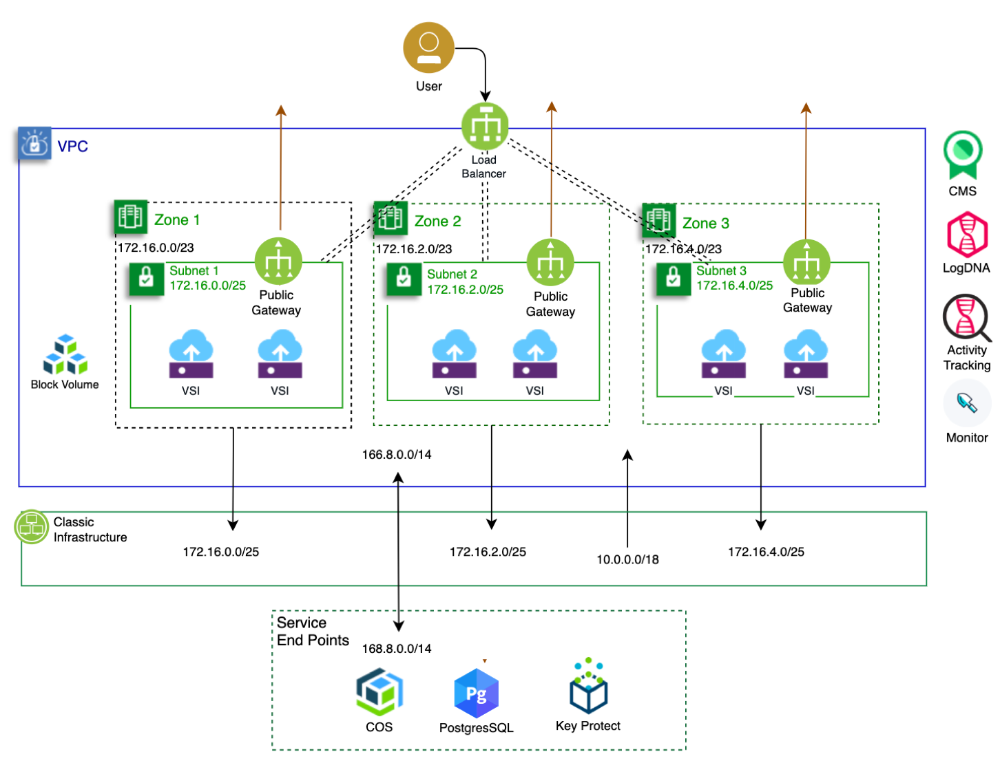
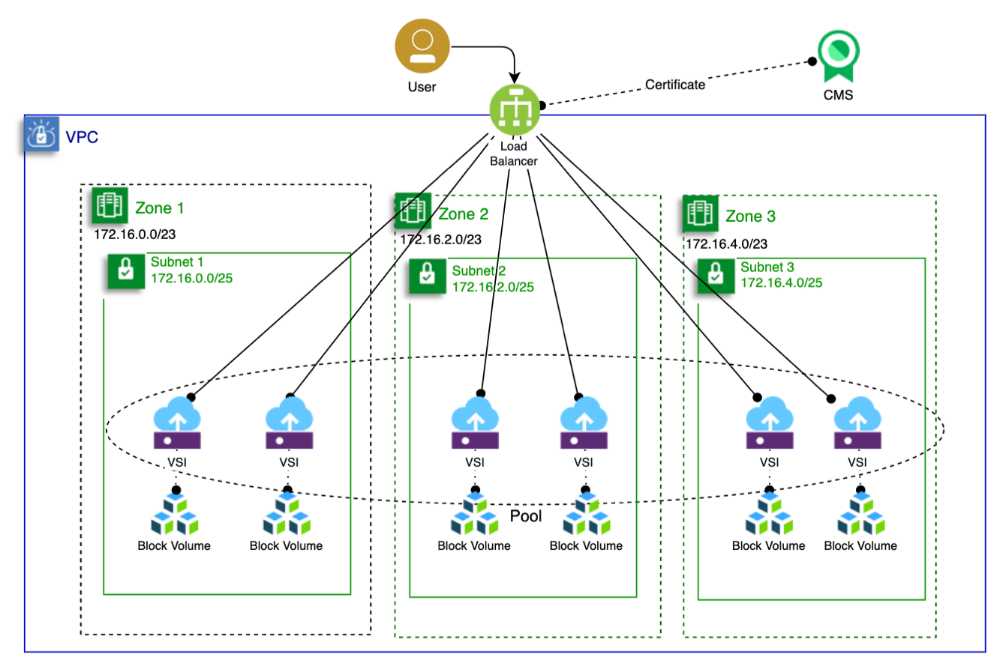
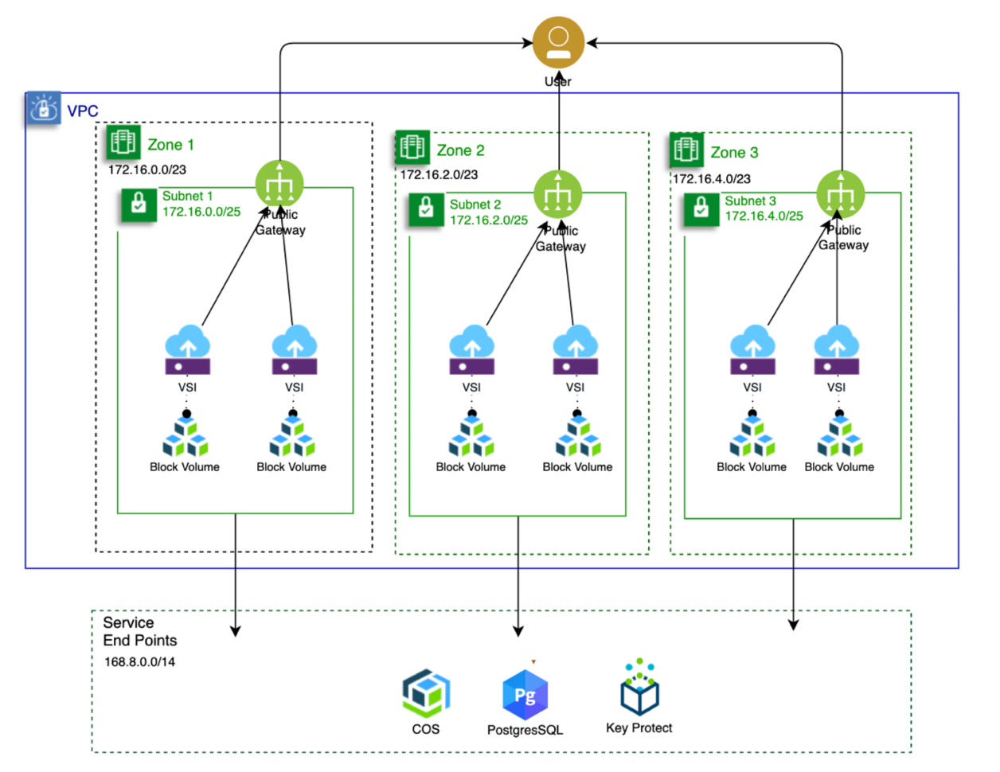

## Networking

Virtual Private Cloud (VPC) is a virtualized private network used to control a logically isolated part of the IBM Cloud where you will provision cloud resources and control access and communications. A VPC also provides a means to communicate, privately with cloud services such as data and storage and communicate with the public internet, if desired. The VPC network includes high availability services to ensure resilency.

### Overall Architecture

### Components

 [VPC](https://cloud.ibm.com/docs/vpc-on-classic?topic=vpc-on-classic-getting-started): This solution uses the IBM Cloud VPC as the core network service and to control network architecture within the VPC. The VPC will be deployed with three zones to ensure resilency.

- [Classic Networks](https://cloud.ibm.com/docs/vpc-on-classic?topic=vpc-on-classic-about&locale=en-us#classic-access): This solution does not explicity use classic infrastructure resources. However, you may use a [bastion host](https://cloud.ibm.com/docs/vpc-on-classic?topic=solution-tutorials-vpc-secure-management-bastion-server&locale=en-us) to test the results of provisioning using the scripts included in this repository.

- [Service End Points](https://cloud.ibm.com/docs/resources?topic=resources-service-endpoints&locale=en-us): IBM Cloud services used in this solution are accessed using their private service end points as noted in the [IBM Cloud Object Storage tutorial](https://cloud.ibm.com/docs/vpc-on-classic?topic=vpc-on-classic-connecting-to-ibm-cloud-object-storage-from-a-vpc&locale=en-us#cos-direct-endpoints-for-use-with-vpc).

  
### VPC Load Balancing 

- [Load Balancer (LBaaS)](https://cloud.ibm.com/docs/vpc-on-classic-network?topic=vpc-on-classic-network---using-load-balancers-in-ibm-cloud-vpc&locale=en-us): The LBaaS provides ingress-only connectivty with the public internet or private load balancing for internal networking. This example uses

  - a load balancer attached to all of the subnets creating an instance for each subnet

  - listeners to monitor incoming traffic for a specific port / protocol traffic

  - uses LBaaS name versus IP as the number of IPs may increase with traffic loading

  - a certificate for [SSL/TLS termination](https://cloud.ibm.com/docs/vpc-on-classic-network?topic=vpc-on-classic-network---using-load-balancers-in-ibm-cloud-vpc&locale=en-us#ssl-offloading-and-required-authorizations) that is [managed](https://cloud.ibm.com/docs/services/certificate-manager?topic=certificate-manager-about-certificate-manager) by the [Certificate Manager (CMS)](https://cloud.ibm.com/docs/services/certificate-manager?topic=certificate-manager-getting-started#getting-started) service. The scripts also [authorize LBaaS to access the certificate](https://cloud.ibm.com/docs/iam?topic=iam-serviceauth&locale=en-us#create-auth) in CMS.

  - a [load balancing pool](https://cloud.ibm.com/docs/vpc-on-classic-network?topic=vpc-on-classic-network---using-load-balancers-in-ibm-cloud-vpc&locale=en-us#front-end-listeners-and-back-end-pools) to distribute load across all VSIs in the VPC

  - [http to communicate between LBaaS and each VSI](https://cloud.ibm.com/docs/vpc-on-classic-network?topic=vpc-on-classic-network---using-load-balancers-in-ibm-cloud-vpc&locale=en-us#front-end-listeners-and-back-end-pools) over the VPC subnet.

### VPC Public Gateway 

- [Public Gateway](https://cloud.ibm.com/docs/vpc-on-classic-network?topic=vpc-on-classic-network-about-networking-for-vpc&locale=en-us#use-a-public-gateway) This solution is design to allow communications, originated by applications in the VPC, to the public internet via the public gateway. This enables end users to whitelist the application in the VPC since all application instances in VSIs would [use the same outbound end point](https://cloud.ibm.com/docs/vpc-on-classic-network?topic=vpc-on-classic-network-about-networking-for-vpc&locale=en-us#use-a-public-gateway).
